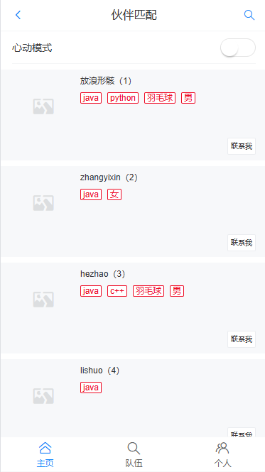
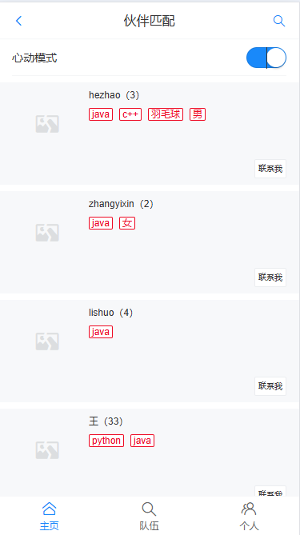
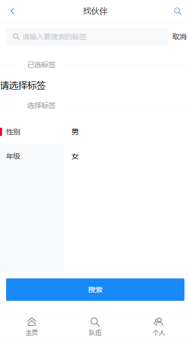
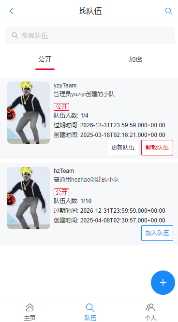
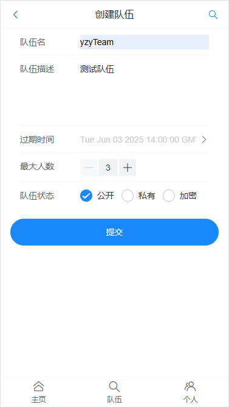

# 校园兴趣部落匹配系统

## 项目简介

| 校园兴趣部落匹配系统 | 2025.01-2025.03 |
| -------------------- | --------------- |
|                      |                 |

校园兴趣部落匹配系统 2025.01-2025.03

https://github.com/flash-yzy/Campus-Interest-Tribe-Matching-System 

项目职责：负责需求分析、系统设计和功能实现等工作，基于SpringBoot框架和Redis缓存技术，实现了用户标签匹配、相似用户推荐、组队等功能，并通过性能优化和异常处理机制，提升了系统的稳定性和用户体验。

项目描述：基于SpringBoot的移动端网站，实现按标签检索用户、推荐相似用户、组队等功能。
• 使用Easy Excel读取用户信息，并通过自定义线程池+CompletableFuture并发编程提高批量导入数据库的性能。
• 使用Redis实现分布式Session，解决集群间登录态同步问题；使用Hash代替String存储用户信息，节约9.1%的内存。
• 使用Spring Scheduler定时任务来实现缓存预热，解决首次访问系统的用户主页加载过慢的问题，并利用Redisson实现分布式锁，避免多机部署时定时任务。
• 使用Redisson MultiLock将用户、队伍对象关联为一个联锁，实现操作互斥，解决同一用户重复加入队伍、入队人数超限的问题，保证接口幂等性。
• 使用编辑距离算法实现根据标签匹配最相似的用户功能，并通过优先队列减少TopN运算过程的内存占用。
• 针对项目中复杂集合处理的问题，使用Java 8 Stream API和Lambda表达式简化编码。 
• 通过自定义统一的错误码，封装全局异常处理器，规范异常返回，屏蔽项目冗余的报错细节。

主页：

找伙伴：

组队功能：

创建队伍：

个人信息及修改：

## 技术选型

### 前端

- Vue 3
- Vant UI 组件库
- TypeScript
- Vite 脚手架
- Axios 请求库

### 后端

- Java SpringBoot 2.7.x 框架
- MySQL 数据库
- MyBatis-Plus
- MyBatis X 自动生成
- Redis 缓存（Spring Data Redis 等多种实现方式）
- Redisson 分布式锁
- Easy Excel 数据导入
- Spring Scheduler 定时任务
- Swagger + Knife4j 接口文档
- Gson：JSON 序列化库
- 相似度匹配算法

### 部署

- Serverless 服务
- 云原生容器平台
